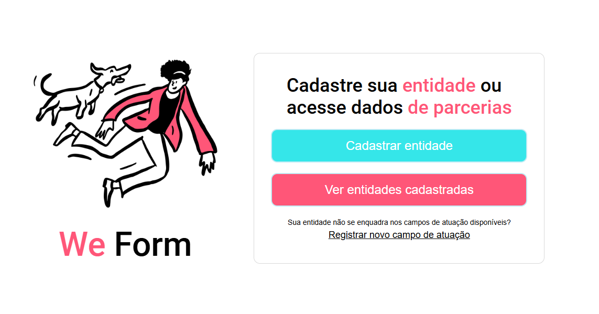
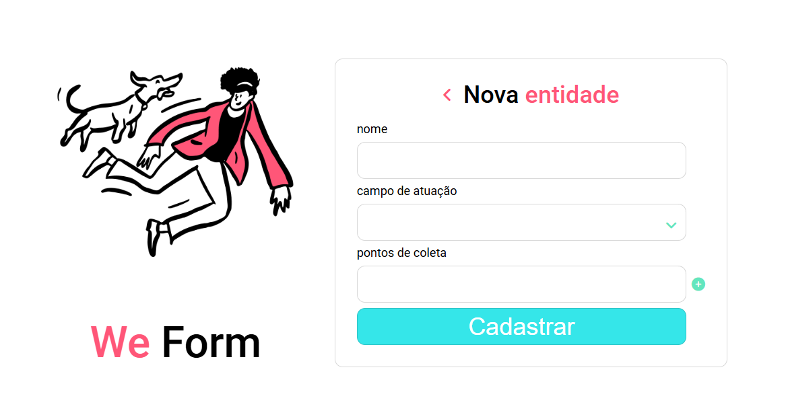
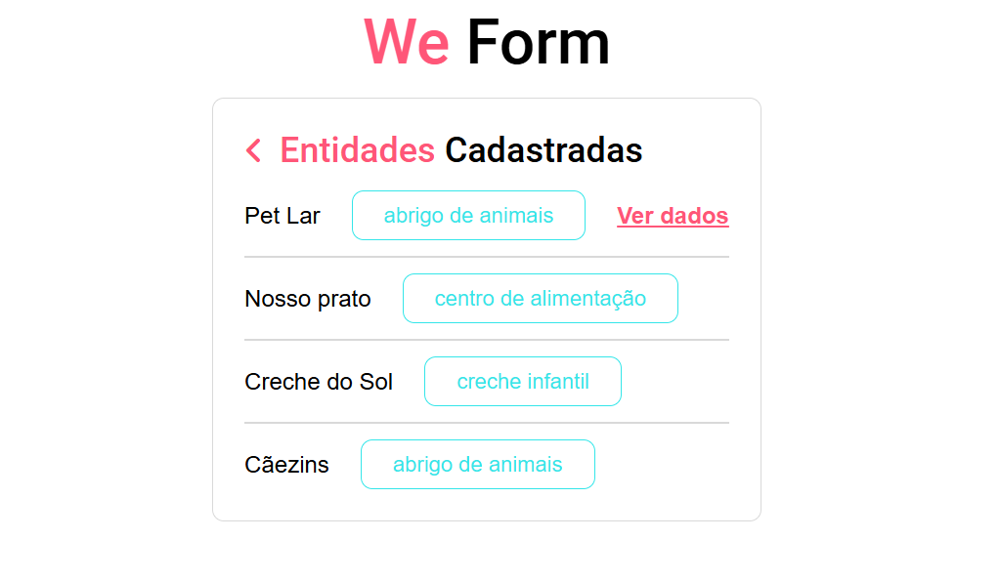
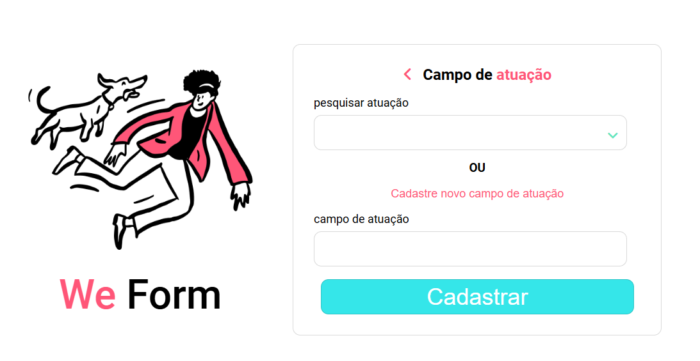

# Projeto We Form

O projeto foi criado como finalização do curso de CSS do Santander Tech+ e da Ada Tech.

### Tecnologias Utilizadas
* HTML
* CSS
* Font Awesome Icons

## Telas

<h3 align="center">Home</h3>

<h3 align="center">Tela de Cadastro</h3>

<h3 align="center">Listagem de Entidades</h3>

<h3 align="center">Tela de Cadastro</h3>

